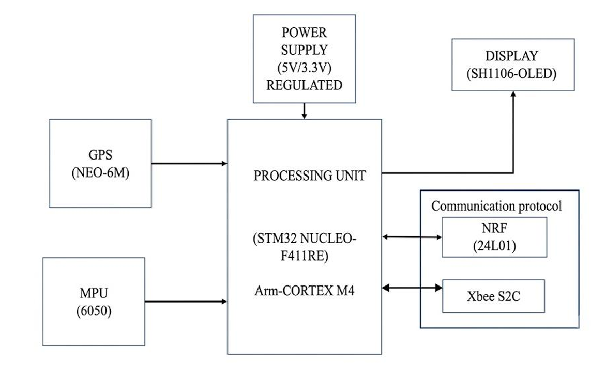
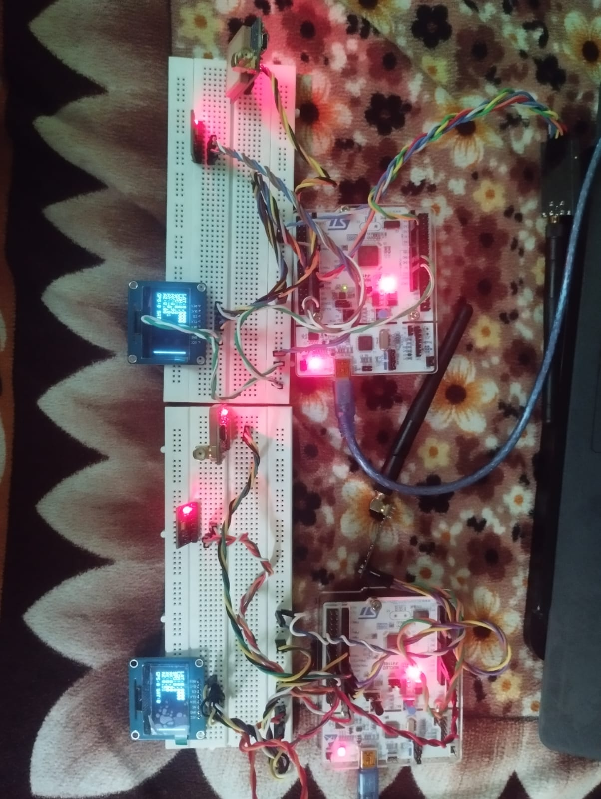
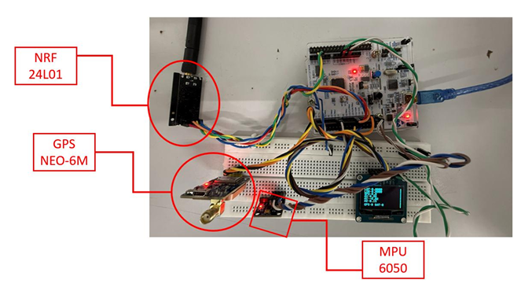
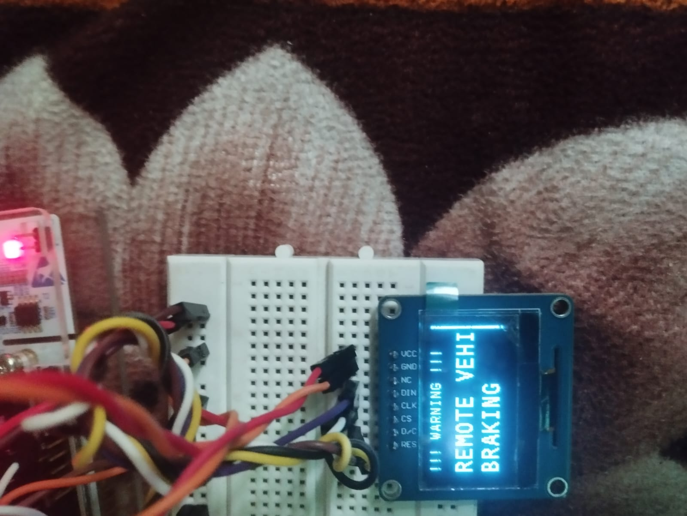

# 🚗 STM32-Based Vehicle-to-Vehicle (V2V) Collision Warning System

An embedded Vehicle-to-Vehicle (V2V) Collision Warning System developed using the **STM32F411RE Nucleo-64**, **NRF24L01+ wireless transceiver**, **NEO-6M GPS**, **MPU6050 IMU**, and **1.3-inch SH1106 SPI OLED Display**. The system enables two vehicles to exchange real-time information such as speed, GPS coordinates, acceleration, and braking status, providing timely warnings to improve road safety.

---

## 📌 Features

- Real-time Vehicle-to-Vehicle (V2V) Communication
- Wireless Data Exchange using NRF24L01+
- GPS-based Vehicle Speed Monitoring
- GPS-based Latitude and Longitude Tracking
- MPU6050 Acceleration Monitoring
- Emergency Brake Detection
- OLED Display for Driver Information and Warnings
- TDMA-based Communication Protocol
- Developed using STM32 HAL Library

---

## 🛠 Hardware Used

| Component | Quantity |
|-----------|:--------:|
| STM32F411RE Nucleo-64 | 2 |
| NRF24L01+ | 2 |
| NEO-6M GPS | 2 |
| MPU6050 | 2 |
| SH1106 1.3" SPI OLED | 2 |

---

## 💻 Software Used

- STM32CubeIDE
- STM32 HAL Library
- Embedded C
- Git & GitHub

---

# System Architecture

<p align="center">

</p>

---

# Hardware Prototype

<p align="center">

</p>

---

# OLED Display

### Normal Display

<p align="center">

</p>

Displays:

- Latitude
- Longitude
- Speed
- Acceleration (AX, AY, AZ)
- GPS Fix Status

---

### Brake Warning

<p align="center">

</p>

Displays a warning whenever emergency braking information is received from another vehicle.

---

# Working Principle

1. GPS module continuously acquires vehicle position and speed.
2. MPU6050 measures vehicle acceleration.
3. STM32 processes the sensor data.
4. A data packet containing vehicle information is created.
5. NRF24L01 wirelessly transmits the packet.
6. The receiving vehicle decodes the received packet.
7. If emergency braking is detected, the OLED displays a warning message.
8. A TDMA communication scheme is used to reduce packet collisions.

---

# Hardware Connections

## GPS (NEO-6M)

| GPS | STM32 |
|------|--------|
| TX | USART6_RX |
| RX | USART6_TX |
| VCC | 3.3V |
| GND | GND |

---

## MPU6050

| MPU6050 | STM32 |
|----------|--------|
| SDA | I2C1 SDA |
| SCL | I2C1 SCL |
| VCC | 3.3V |
| GND | GND |

---

## NRF24L01+

| NRF24 | STM32 |
|--------|--------|
| CE | GPIO |
| CSN | SPI1 NSS |
| SCK | SPI1 SCK |
| MOSI | SPI1 MOSI |
| MISO | SPI1 MISO |
| IRQ | Not Used |
| VCC | 3.3V |
| GND | GND |

> **Note:** A **10 µF capacitor** is connected across the NRF24L01+ power pins to ensure a stable 3.3 V supply during wireless transmission.

---

## SH1106 SPI OLED

| OLED | STM32 |
|------|--------|
| DIN | SPI1 MOSI |
| CLK | SPI1 SCK |
| CS | GPIO |
| DC | GPIO |
| RST | GPIO |
| VCC | 3.3V |
| GND | GND |

---

# Repository Structure

```
STM32-V2V-Collision-Warning-System
│
├── STM32_Project
├── Images
├── Documents
├── README.md
└── LICENSE
```

---

# Future Improvements

- Vehicle-to-Infrastructure (V2I) Communication
- Road Side Unit (RSU) Integration
- Blind Spot Detection
- CAN Bus Integration
- C-V2X Communication
- Mobile Application Interface

---

# Author

**Atharv Waghmale**

Bachelor of Engineering (Electronics & Telecommunication)

Embedded Systems • Automotive Electronics • IoT • VLSI

---

# License

This project is licensed under the MIT License.
